

```{r}
#| output: asis
#| echo: false
header_image() # fixing header image
```

::: {.disclaimer}
The Confocal Laser Scanning Microscopy (CLSM) facility from Senckenberg am Meer / German Centre for Marine Biodiversity provided support for the Peracarida: Confusing Crustacean II (October 2025) and Ocean Census Isopod Species Discovery workshop (February 2026). This is a short, basic, but thorough guide on how to turn the `.lif` file generated by the Leica Confocal System into a common image file that can be used for notes, documents, or publication, etc. 

The facility has been focused on scanning CLSM images for microscopic invertebrates - not histological slices. Therefore the mindset, process philosophy might differ from work done in other fields also utilizing CLSM. For the both workshop, and generally other occassions when scanning crustaceans, the congo red and acid fucsin has been used to stain the animal targeting the chitin cuticles. 

Suggestions, mistakes, please let me know! 

P.S. I wrote the draft in soberness but I proof read after one glass of gin tonic. So don't be surprised if there're typos. 
:::

For opening the `.lif` file and processing the image stacks, we will use the open source program Fiji (ImageJ).

What's Fiji? [Fiji](https://fiji.sc/) is a package for scientific image analysis—a "batteries-included" distribution of [ImageJ](https://imagej.net/software/imagej) with many plugins. 

You can download Fiji [here](https://imagej.net/software/fiji/downloads). 

## Open `.lif` file

1. Open Fiji, a wide tool window pops:
	
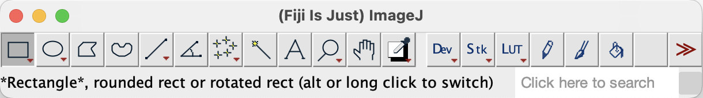{width="60%"}

2. Drag `.lif` file to the window or go to menu File > Open > select `.lif` file
3. A window of *Bio-Formats Import Options* should appear, select:
	- **View Stack with: Hyperstack**
	- **Display metadata** to show the "basic" metadata
	- **Display OME-XML metadata** to show the CLSM metadata (in XML syntax, it's not easy to read but it has all the information such as pixel size, objective lens specs, etc.)

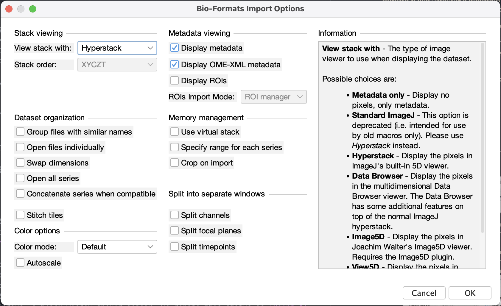{width="60%"}

4. Hit **OK**, should there be multiple items in the `.lif` file, a window will pop up to ask what to import. Following our workflow, there are usually three types of *series*:
    - **Preview series**. These are the trace of live preview. Normally it only has very few z-slices.
    - **Main scan series**. These are the main scan we did, it will have the set number of z-slices and resolutions.
    - **Projections** calculated on the confocal system. Usually a maximum projection will be made on the system to have the quick view of the scan result. This can be accessed too as long as they are saved. 

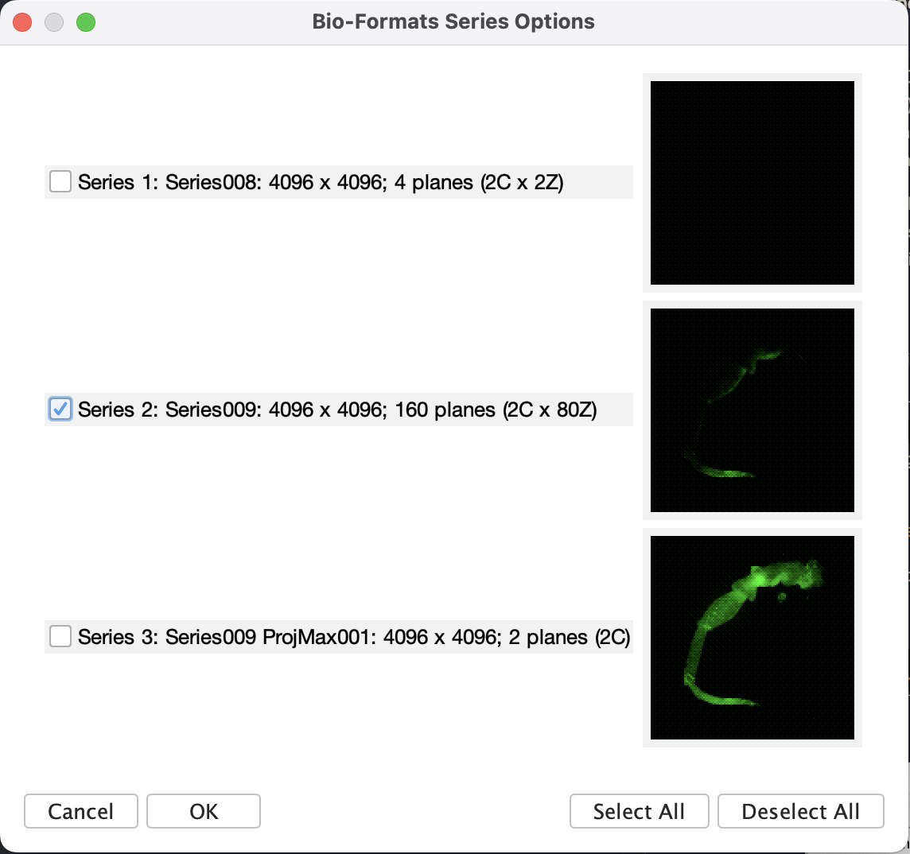{width="60%"}

5. along with two metadata windows, a black window should appear. We denote this status as *Point A*. Note that there are two sliders at the bottom:
	- *c* for Channel, move the slider to change channel
	- *z* for Z-stacks, move the slider to view different z-layers
		- it is dark, because the z-slider is currently at the first layer (see the metadata: `z:1/117`)

        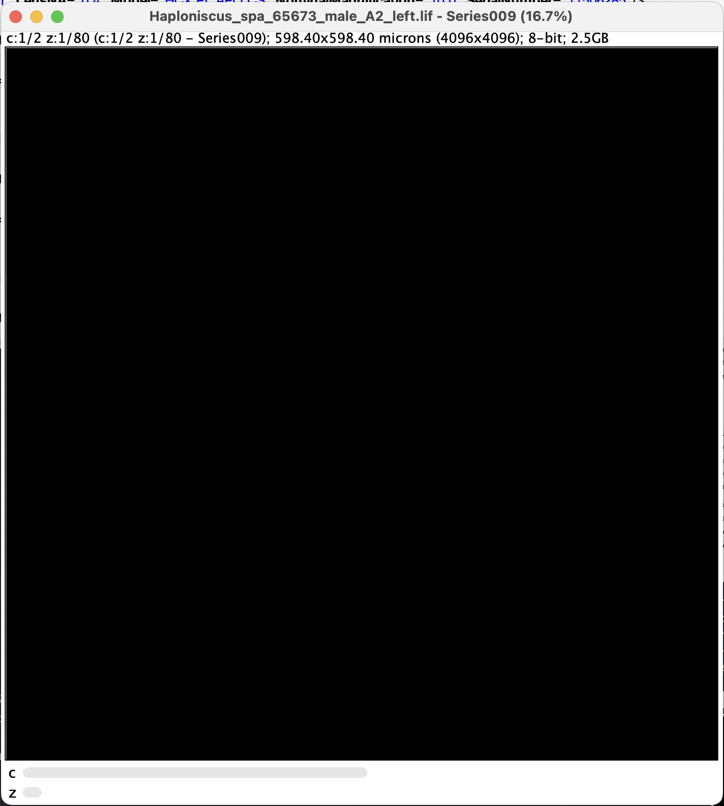{width="60%"}

		- Once we move the z-slider to the middle, signal starts to appear.

        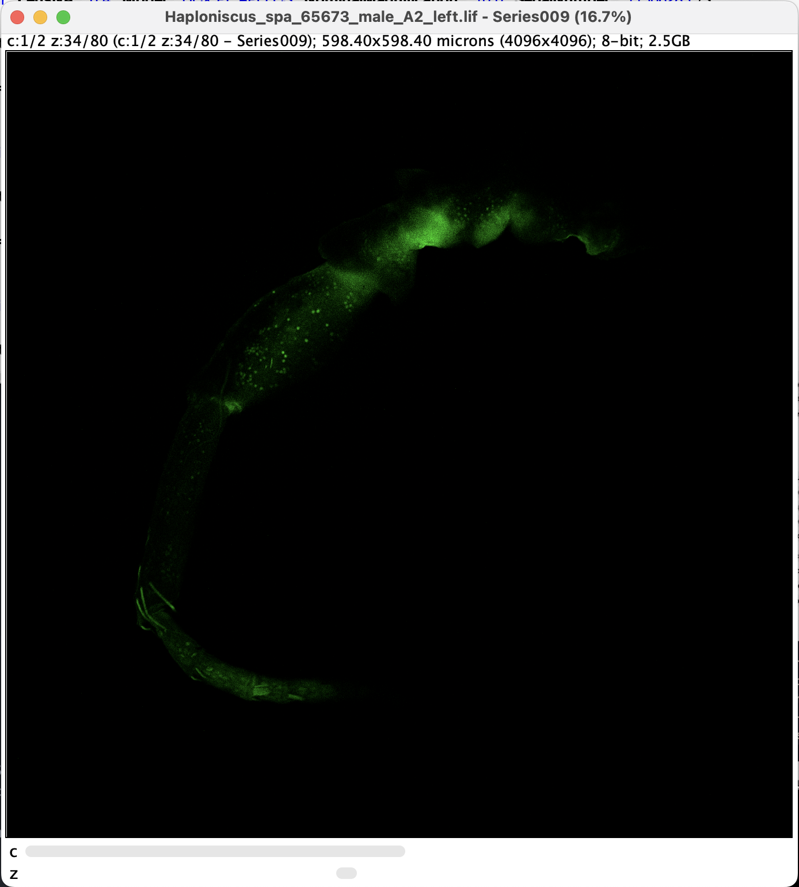{width="60%"}

## Split and Adjust Channels

The presence of c-slider means the images have more than one channels. For CLSM with more than one dye, different channels are usually set to pick up signals from different targets. In our case, the channels are picking up essentially the same signal, but at different wavelength. Even though, sometimes it makes sence to remove one of the channel or edit them individually. 

1. (*From point A*) we can split the channel by applying: Image > Color > Split Channels, then the window turns into two windows with monochrome image (becuase there're two channels):

    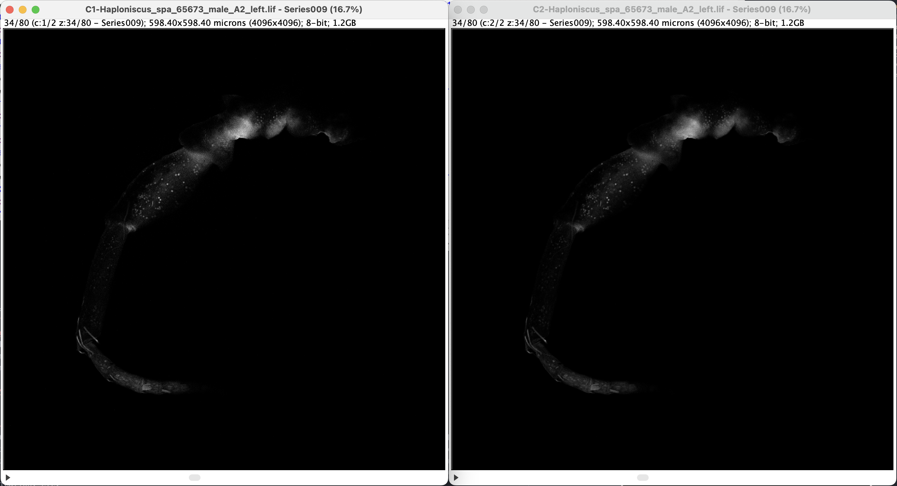{width="80%"}

	- Note that on the window title, channels are differentiated by "C1" and "C2". They look the same (but technically not, just very similar) because the signal comes from the same source. 
	- The monochrome image also implies that all colors one sees from CLSM are **fake colors**. What CLSM picks up is monochrome light intensity data within certain range of wave length (which was set while scanning). 
	- Note that by splitting the channels, the *c* slider disappeared and the slider is not denoted as *z* anymore. Additionally, a play/stop icon appeared (you can play the z-frame like a video by pressing it). Reason for this it that each channel is now treated by ImageJ as individual *Stacks*, rather than altogether as *Hyperstacks*. See documentation [here](https://imagej.net/ij/docs/guide/146-8.html). 
2. For visualization, one can set any arbitrary color for each channel. Click on one of the window to activate the choice, then select a LUT (look-up table) under Image > Lookup Tables. Here's an example of using *Red* and *Yellow*:

    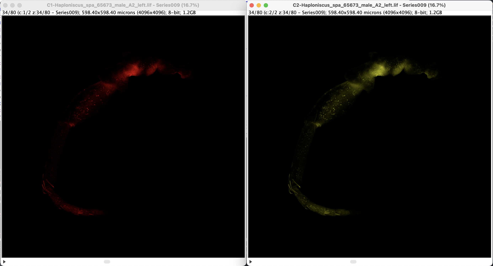{width="80%"}

3. One can also adjust the exposure by applying Image > Adjust > Brightness/Contrast or Window/Level. A new window will, the settings are individual for each channel, to apply adjustment for each channel, click the correspondent channel window. 

## Merge Channels

Once we have each individual channels edited, we can merge them together (for different channel targetting different structure, this will allow visualization of different structure in one image, but the color selection would need more considerations). In our case, both channels have practically the same information, therefore one can decide either to merge them or discard one channel (if one channel has a lot of interference). 

1. Select one of the channel window, then apply: Image > Color > Merge Channels, a windows would pop up:
	
    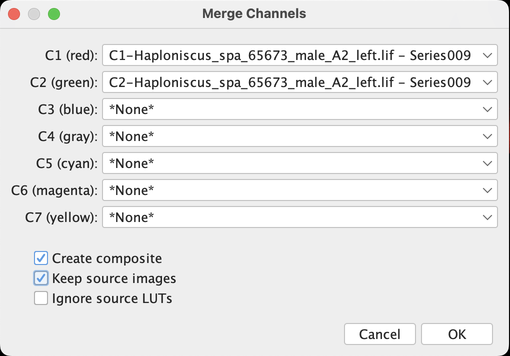{width="60%"}

	- It allows (apparently) merging up to 7 channels, with current process Fiji automatically recognize the two opening channels and place them at C1 and C2.
	- If custom LUTs are assigned to the channels, those will only be applied to the merged composite when *Create composite* is checked and *Ignore source LUTs* is unselected.
	- Unselecting *Create composite* will let Fiji to convert our 8-bit file into RGB file (which is a quality downgrade).
	- When *Create composite* is unselected or *Ignore source LUTs* is checked, the color specified after Cx is applied in merging.
	- A merged composite looks like this. Note that the file is still in 8-bit grayscale (but with LUT, so it's colorful). We denote this composite as *Point B*.

    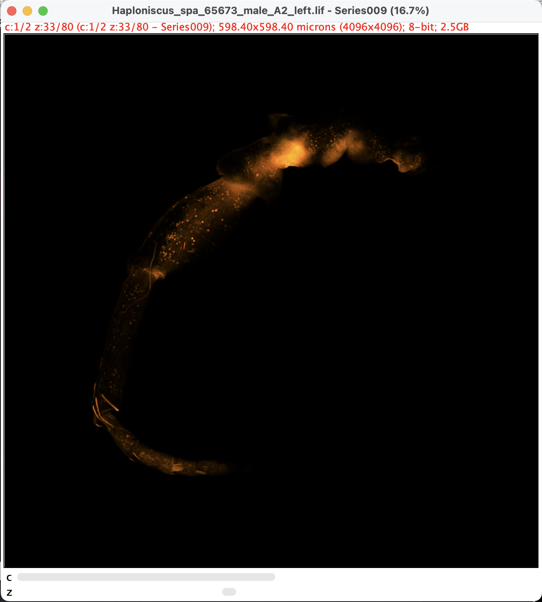{width="60%"}

## Z-Projection

Z-projection flattens the 3-dimensional image series into a single 2-dimensional representation by projecting the images along z-axis. Maximum projection would be the best option for most of our cases, there are of course other options which calculate the "flattenning" with different algorithm. 

1. (*From Point B*) Image > Stacks > Z Project, then a window will pop up:
	
    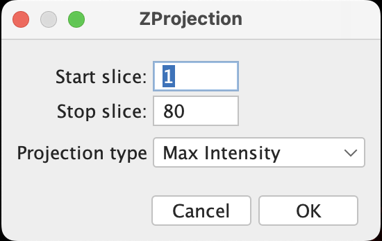{width="40%"}

	- One have the option to exclude certain slices at the top or bottom if there is strong interference. 
2. The projection will be generated in a new window:

    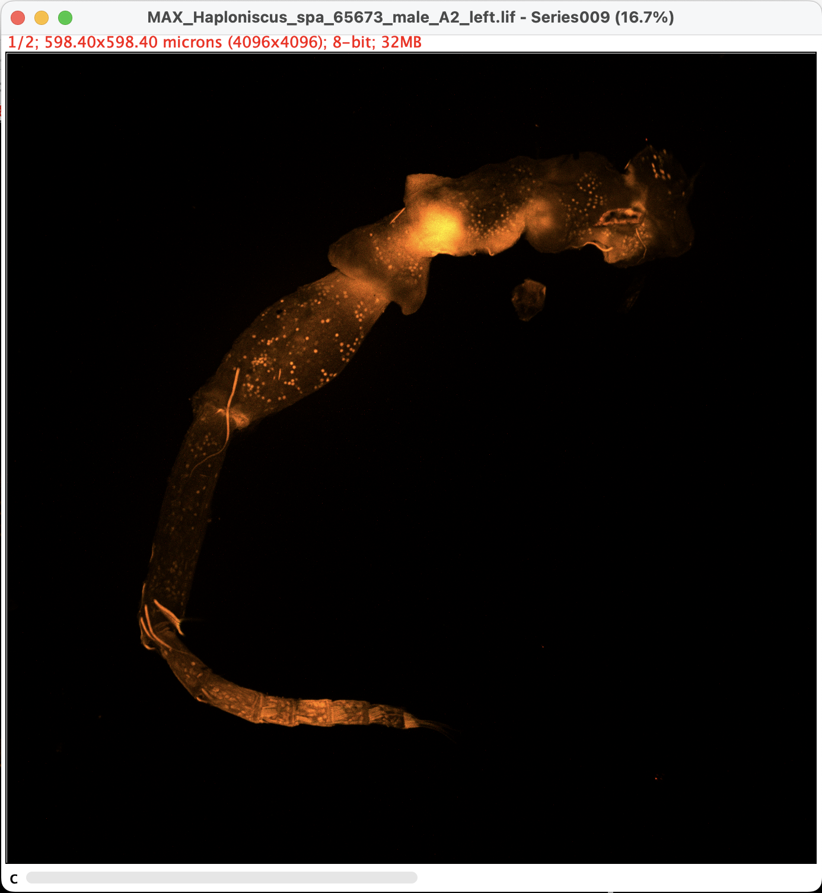{width="80%"}

	- Note that the image is still in 8-bit greyscale and has technically two channels. Which means we are still one step away from export the image. 
3. Convert the 8-bit greyscale image with LUTs into RGB image by: Image > Type > RGB Color. A new window will pop up, without any slider:
	- Now the image is ready to be exported. 

    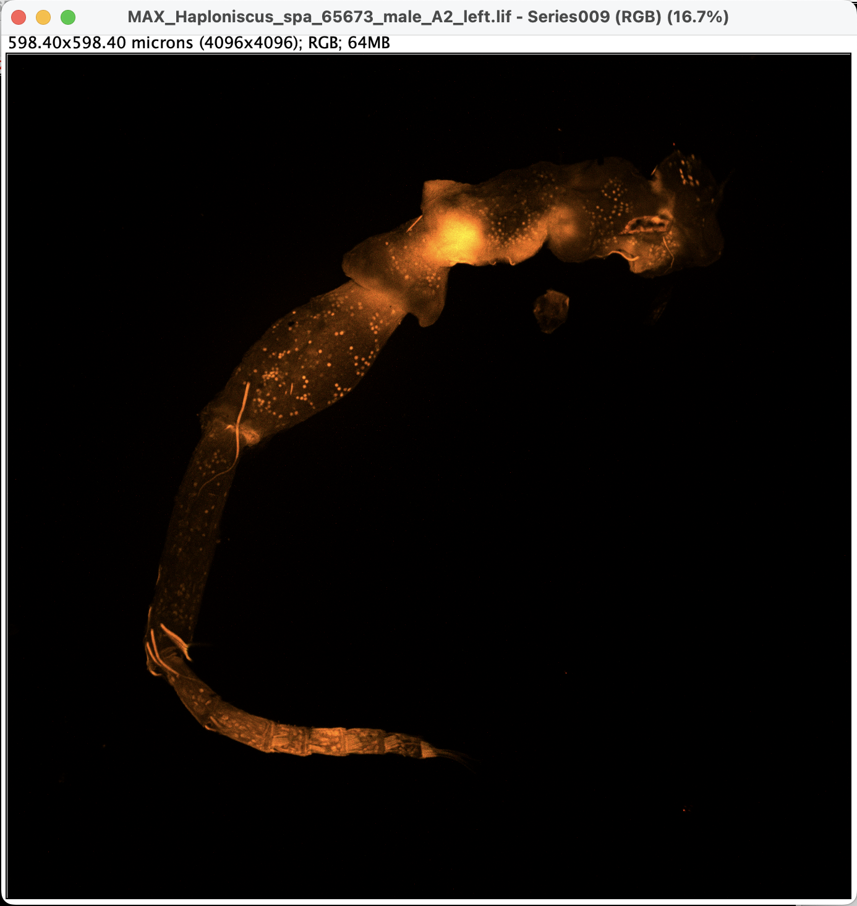{width="80%"}

## Time-Coded / Temporal-Color Projection 

One would notice that Z-projection creates the 2D-visualization by flattening the 3D-scan, which doesn't show the vertical structure of the scanned surface. For object that is not as flat as a single Antenna, it might be worth presenting the structure somehow:

::: {#gif}

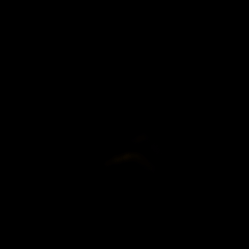{width="60%"}

:::

A visualization way is to use the temporal color. It's called so because it is (probably) widely used in other fields to visualize target movement across time, in which case it differentiates across the time axis instead of z.

This method only works with single-channel image, and it automatically converts the greyscale image into RGB color image, so either we do it on one of the splitted greyscale channel with better quality, or we manually convert the merged composite into RGB color image stack. Note that this method performs calculation on individual images and requires quite amount of memory. If it fails by having not enough memory, try downsize the image before this method.

- To convert the multi-channel composite into RGB color image stack: (*From Point B*) Image > Type > RGB Color. 
- To use one of the splitted channel, split the channel (step 1 at *Split Channels*) after *Point A* and click on the selected channel. 

1. Image > Hyperstacks > Temporal-Color Code. A window will pop up to ask the start and end frame. Note that it now calls the image unit as *frame* (temporal) instead *slice* (spatial). Often there are a few slices at the beginning and end of the scan that do not contain too much information, it's better to exclude those slices from this projection to maximize the color contrast shown on the final projection.

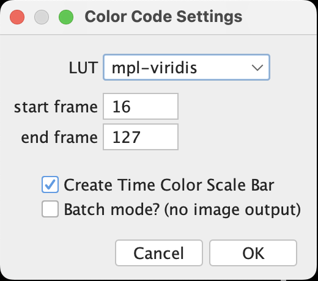{width="40%"}

2. Done! Should the option *Create Time Color Scale Bar* be selected, a scale bar window will be generated. These are already in RGB so they can be exported directly.

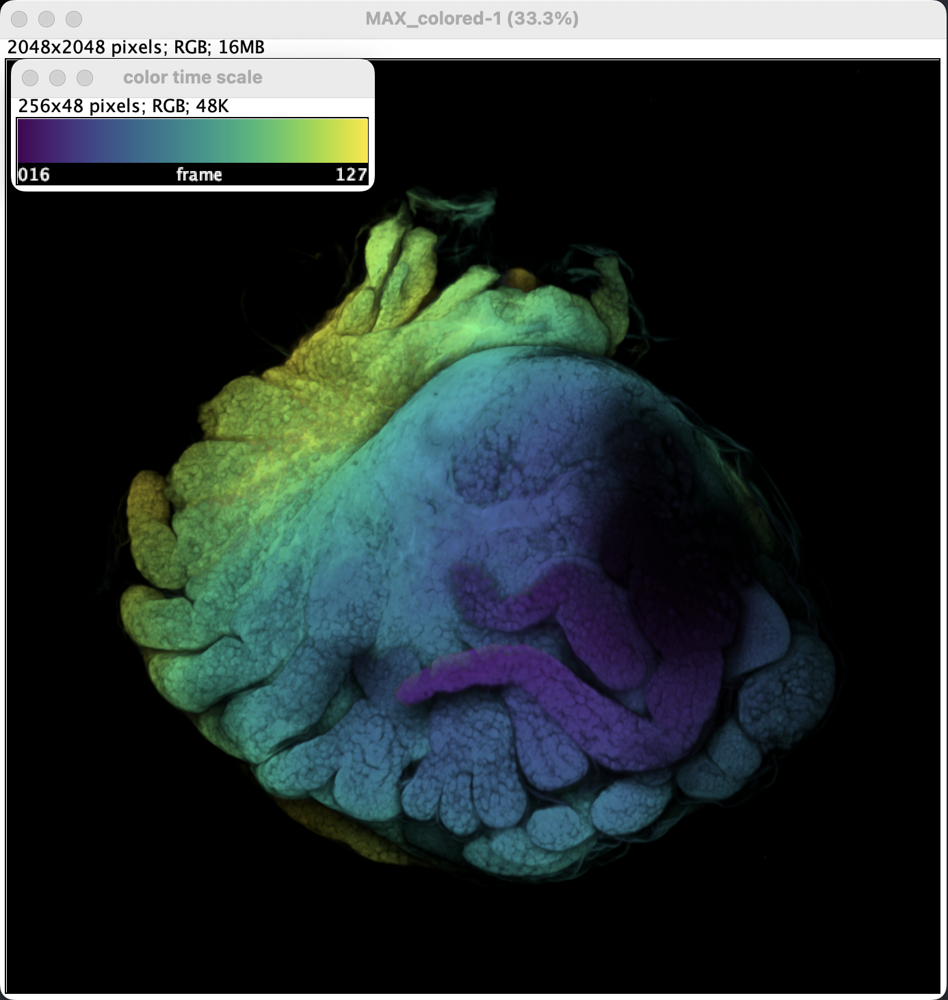{width="80%"}

3. A little bit of brightness adjustment and it's ready to be exported.

## Resize

The original image size might demand great amount of memory to process the images, especially when scanned under 4k resolution, for certain usage a lower resolution will probably do the work just fine too. The image can be resized at anytime (at least within this introduction) by applying Image > Adjust > Size. 

Make sure to check *Average when downsizing* to obtain the best quality when downsizing. Bicubic interpolation is considered generally better than bilinear but its computationally more complex and doesn't really make big difference in practice, at least when it comes to downsizing. 

## Scale Bar

- A proper CLSM picture needs a scale bar.
- If you are not sure if you need a scale bar, read the previous point.

The scale bar is calculated based on the pixel size stored in the metadata. The metadata stays linked with the image as long as the image is in greyscale. 

1. Go to Analyze > Set Scale, a window should pop up with scale set automatically. The *Distance in pixel* is the same value as 1/pixel size if the units of both are set to micron. As the RGB images we generate later from the 8-bit greyscale will lose the link to metadata, make sure the *Global* is checked, which applies the scale bar setting to all other picture instances.

    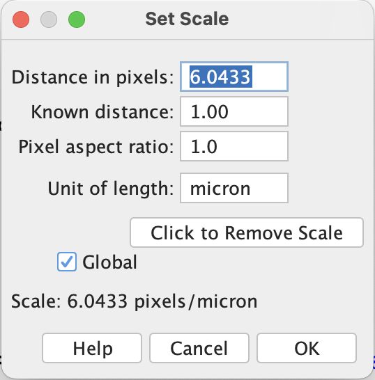{width=40%}

2. Apply Analyze > Tools > Scale Bar to add the scale bar. If everything's set correctly, the windows popped up should have the width and height (if vertical) control in micron. Then adjust the other settings as desired.

    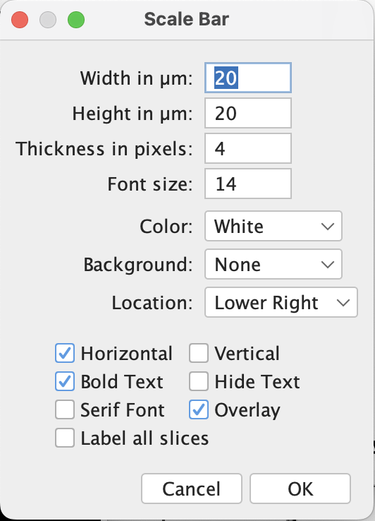{width=40%}

3. Whoala, there you go. 

    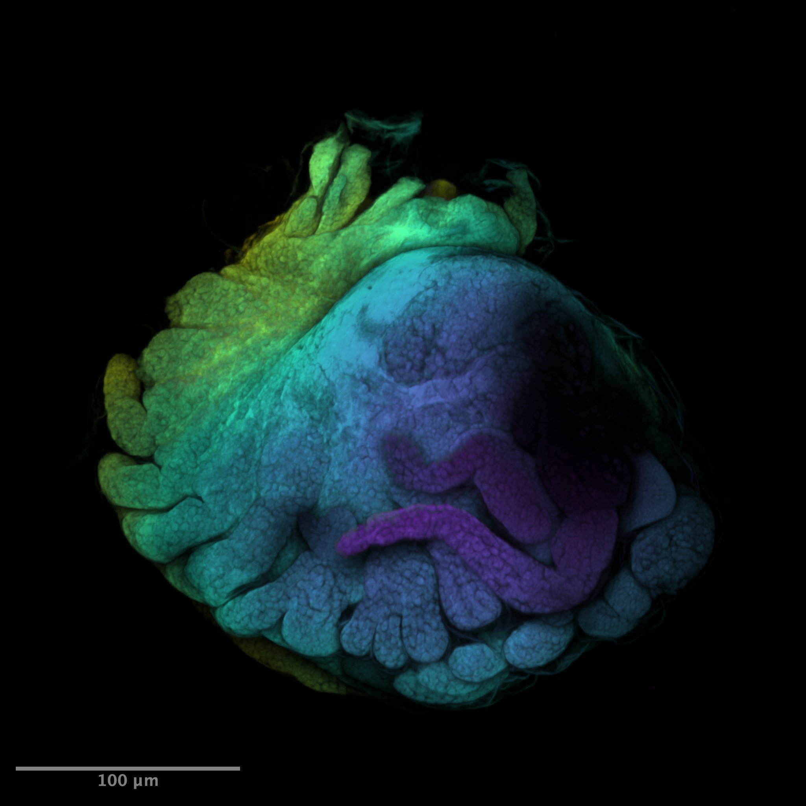{width="80%"}

## Export and More

Finally! After you have finished your editing, you have hopefully an RGB image (or stacks) open in your window. With that, you can export your image via File > Save As. 

If you have a image stack and you want to export the image sequence, go for File > Save As > Image Sequence and set the format and naming rule as desired. If you have [**ffmpeg**](https://www.ffmpeg.org) (you can install via [Homebrew](https://formulae.brew.sh/formula/ffmpeg)), the image sequences can be assembled into short video or gif with command like this:

```zsh
ffmpeg -i Haploniscus_1744alpha_side2_sequence%4d.png -loop 0 -vf "scale=500:-1,split[s0][s1];[s0]palettegen[p];[s1][p]paletteuse" Haploniscus_1744alpha_side2.gif
```

This command was used to produce [this gif](#gif), you can find details for a lot more options and powerful functions in its [document](https://www.ffmpeg.org/ffmpeg.html) (it saved me hundreds of hours on an expedition).

## Last

If you ever wondered what the last scan was, it's a baby baby isopod (*Antennuloniscus dimeroceras*) found in a brooding female's marsupium. 

::: {layout-ncol=2}

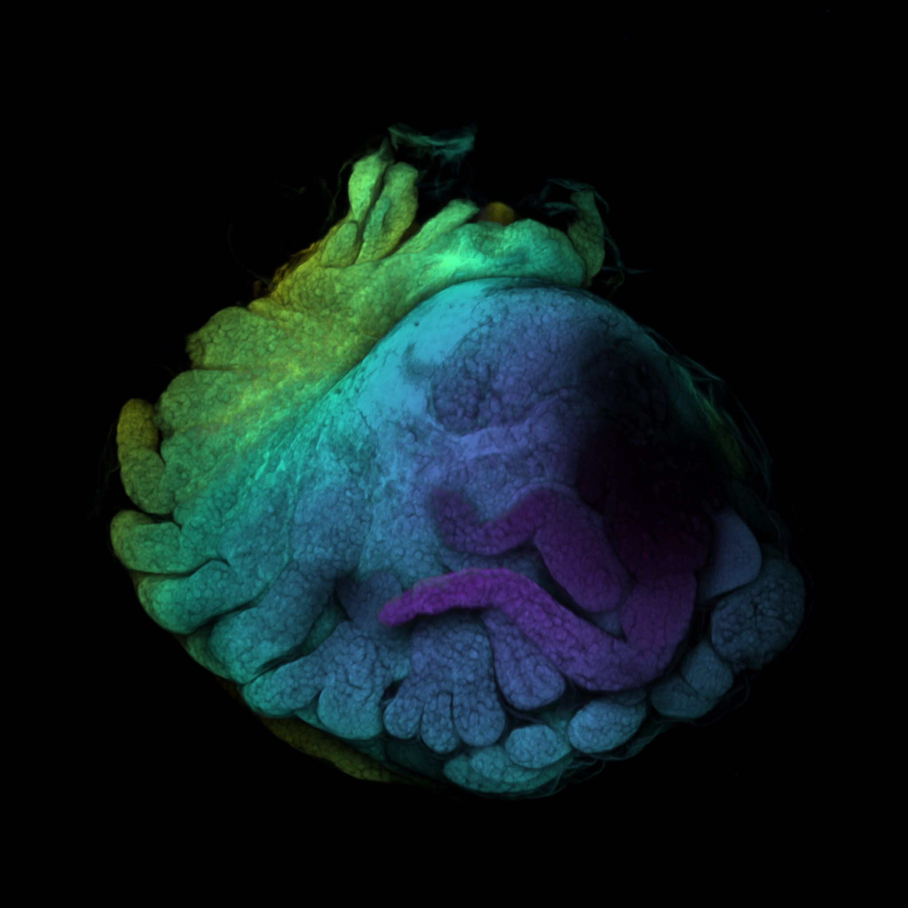{width=30%}

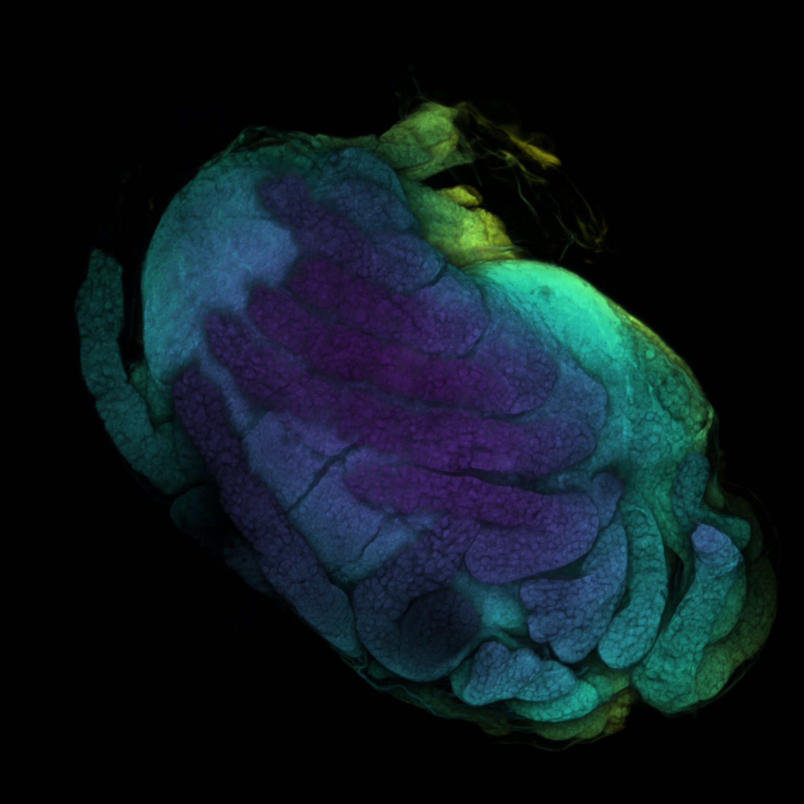{width=30%}

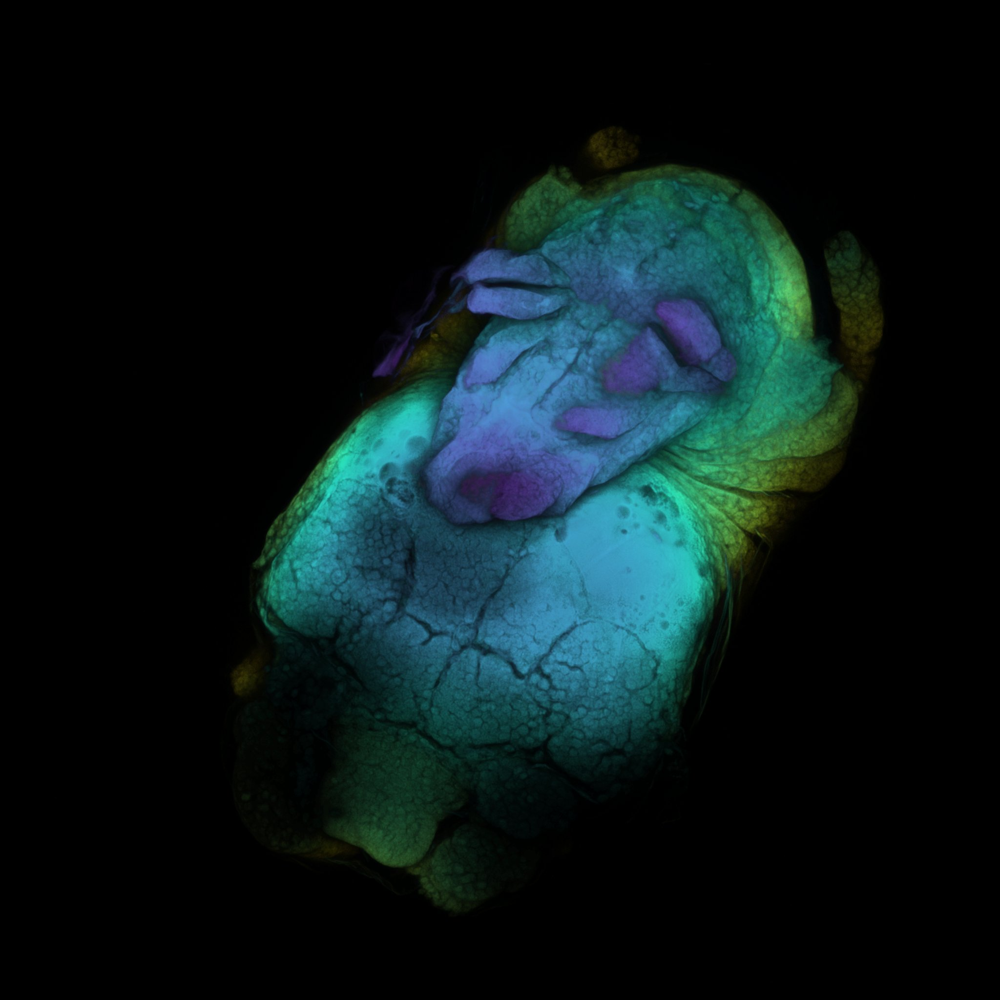{width=30%}

:::

